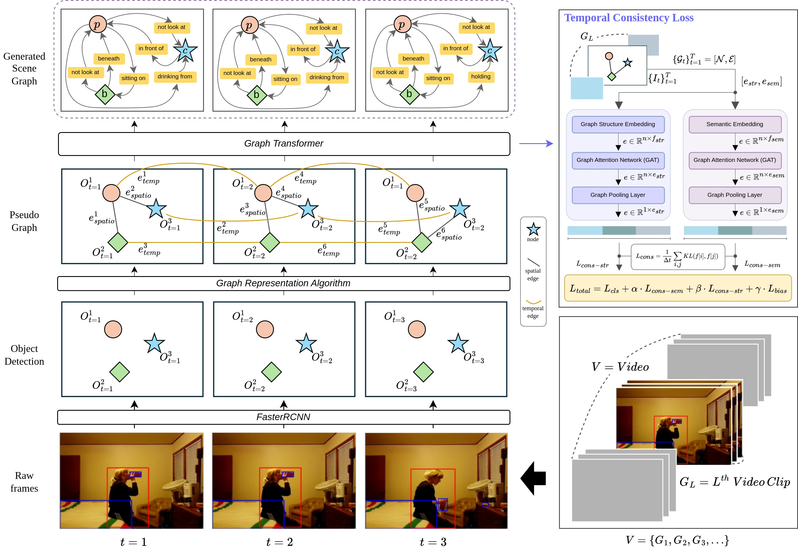

# Learning Temporal Consistency for Video Scene Graph Generation          

**Abstract** It is well known that representing detailed information about objects in an image using text symbols is effective for high-level image reasoning tasks. Especially, a scene graph, which represents the characteristics of objects and their spatial relationships in a graph, is effective for solving complex visual question answering or image generation problems. In the same context, it is known that representing the content of a video given as a sequence of image frames into a scene graph helps solve problems like video question answering. However, generating a scene graph from a video is still known to be a challenging problem. This is because predicting not only the spatial relationships of objects within each frame but also their temporal relationships requires a comprehensive understanding of videos in both spatial and temporal dimensions. In this paper, we point out the issue with existing video scene graph generation problems, which perform Scene Graph Generation (SGG) frame-wise, thus failing to maintain semantic consistency on the temporal axis. To address this, we propose a new regularization method that ensures a certain level of semantic consistency between temporally adjacent graphs. Specifically, we propose a robust measure based on graph theory that considers the temporal and spatial structure consistency of the generated graphs. By using the proposed method to perform the scene graph generation problem on the Action Genome dataset, we demonstrate improvements not only in prediction accuracy but also in temporal consistency at a meaningful level.

## Architecture

## Reference Link
- Tokenized Graph Transformer Reference: https://arxiv.org/abs/2207.02505
- Action Genome Dataset Reference: https://openaccess.thecvf.com/content_CVPR_2020/papers/Ji_Action_Genome_Actions_As_Compositions_of_Spatio-Temporal_Scene_Graphs_CVPR_2020_paper.pdf
- Unbiased Video Scene Graph Generation Reference: https://openaccess.thecvf.com/content/CVPR2023/papers/Nag_Unbiased_Scene_Graph_Generation_in_Videos_CVPR_2023_paper.pdf
